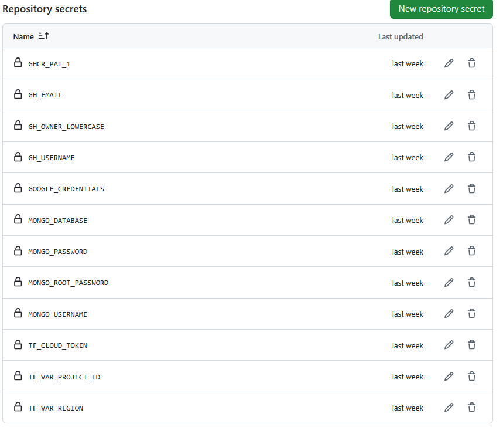

This repository contains the infrastructure and deployment configuration for a web service application in GCP. It leverages Terraform for infrastructure provisioning, Kubernetes for container orchestration, and Google Cloud Platform (GCP) as the cloud provider. The application is deployed using a combination of Kubernetes resources and Helm charts.

## Features
    Infrastructure as Code (IaC):
    Terraform is used to provision GCP resources, including Kubernetes clusters and static IP addresses.
Kubernetes Deployment:
Kubernetes manifests are defined for deploying the gRPC service.
Includes configurations for deployments, services, secrets, and resource limits.
GitHub Container Registry (GHCR):
Docker images are built and pushed to GHCR.
Kubernetes uses a secret to pull images securely from GHCR.
Helm Integration:
Helm is configured for managing Kubernetes resources.

## Prerequisites
Google Cloud Platform (GCP):
A GCP project with billing enabled.
A service account with the necessary permissions.
Terraform:
Install Terraform (v1.10.4 or later).
Kubernetes:
A Kubernetes cluster running on GCP (GKE).
kubectl configured to access the cluster.
Docker:
Docker installed for building and pushing images.
GitHub Personal Access Token (PAT):
A PAT with read:packages and write:packages permissions for GHCR.

## Setup Instructions
    GCP account
    Terraform Cloud account
    Fork of repository

# GCP

Create new Project

Create credentials for the terraform cloud user. Navigate to IAM & Admin/Service Accounts. Create new Service account e.g. terraform, assign it Owner priviledges. Navigate again to Service Accounts and select your newly created account. From there go to KEYS and create new private key. Make sure to select JSON Download the key to your local. Important Use following command to base64 encode it. Important

  cat gcp-credential.json | tr -s '\n' ' ' | base64

    Important Enable APIs for GKE and Cloud Resource Manager Important

# Terraform Clound

    Create new free account
    Navigate to your profile
    Create Terraform API token

# Github

    Navigate to your profile / Developer settings
    Select Personal access tokens / Tokens (classic)
    Generate new token
    Go back to your forked repo and add following repository secrets and variables

    Enable Github actions in the Forked repo
    Run Build Image and Deploy Infra

## Configure Terraform Variables
Update the variables.tf file or provide a terraform.tfvars file with the following variables:

project_id: Your GCP project ID.
region: The GCP region (e.g., us-central1).
google_credentials: Base64-encoded GCP service account key.
github_username: Your GitHub username.
github_email: Your GitHub email.
github_token: Your GitHub Personal Access Token.
MongoDB credentials (mongodb_root_password, mongodb_username, mongodb_password, mongodb_database).
3. Deploy Infrastructure
Run the following commands to provision the infrastructure:

cd terraform_deployment/terraform
terraform init
terraform apply
